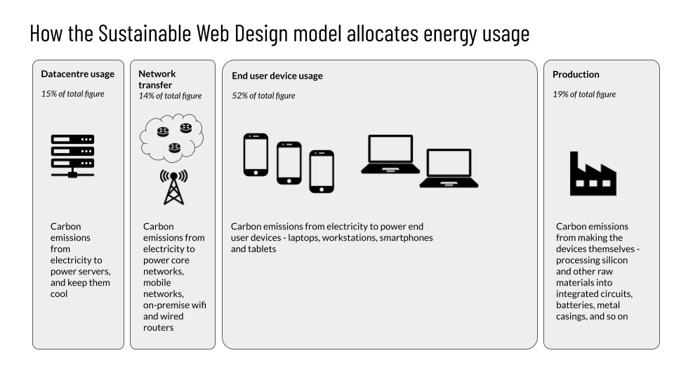

# How to use the different models in CO2.js

CO2js offers two models for understanding the environmental impact of compute - the 1byte model (`1byte.js`), and the Sustainable Web Design model (`swd.js`)

### The 1byte model

The default model in use is the 1byte model as used by the Shift Project, as introduced in their report on CO2 emissions from digital infrastructure, [Lean ICT: for a sober digital][soberDigital].

This returns a number for the estimated CO2 emissions for the corresponding number of bytes sent over the wire, and has been used for video streaming, file downloads and websites.

```js
// assume you have imported or required the CO2 class from 1byte.js
// for your runtime - either a browser, nodejs, etc.

const bytesSent = (1024 * 1024 * 1024)
const co2Emission = new CO2();
const estimatedCO2 = co2Emission.perByte(bytesSent)
```


### The Sustainable Web Design model

As of version 0.9, CO2.js also provides the  [Sustainable Web Design model][swd] for calculating emissions from digital services. As the name suggests, this has been designed for helping understand the environmental impact of websites. Further details are available on the [Sustainable Web Design website explaining the model](https://sustainablewebdesign.org/calculating-digital-emissions/), but for convenience, a short summary is below.

#### How the SWD works

This model uses data transfer as an proxy indicator for total resource usage, and uses this number to extrapolate energy usage numbers for your application as a fraction of the energy used by the total system comprised of:

1. the use-phase energy of datacentres serving content
2. the use-phase energy network transfering the data
3. the use-phase energy of user device an user is accessing content on
4. the total embodied energy used to create all of the above



It then converts these energy figures to carbon emissions, based on the carbon intensity of electricity from the [Ember annual global electricity review][Ember-annual-global-electricity-review].

The carbon intensity of electricity figures for the swd model include the the full lifecycle emissions including upstream methane, supply-chain and manufacturing emissions, and include all gases, converted into CO2 equivalent over a 100 year timescale.

This follows the approach used by the IPCC 5th Assessment Report Annex 3 (2014), for the carbon intensity of electricity.

[Ember's methodology notes][ember-methodology] detail where the rest of this data comes from in more detail, as well as any further assumptions made.


[ember-methodology]: https://ember-climate.org/app/uploads/2022/03/GER22-Methodology.pdf

[Ember-annual-global-electricity-review]: https://ember-climate.org/insights/research/european-electricity-review-2022/


### Sample usage

```js
// assume you have imported or required the CO2 class from swd.js
// for your runtime - either a browser, nodejs, etc.

// assume a 1 megabyte webpage
const bytesSent = (1024 * 1024 * 1024)

const co2Emission = new CO2();
const estimatedCO2ForTransfer = co2Emission.emissionsPerVisitInGrams(bytesSent)
```

[soberDigital]: https://theshiftproject.org/en/lean-ict-2/
[swd]: https://sustainablewebdesign.org/calculating-digital-emissions
